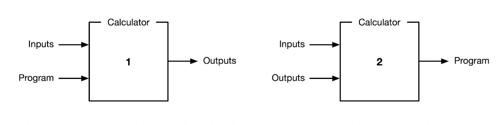
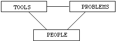

# Research Statement

I am a software engineer in the KAST lab at McGill University, under the supervision of Jin Guo. There, I am building tools to help software engineers find information and reason about software, by learning to read and write code.

Program synthesis is starting to show a number of practical applications for software engineering, e.g. code completion, static analysis, and information retrieval. My research seeks to aid humans designing and maintaining programs by helping them locate information and manipulate the structure of connected software applications.

As a software engineer, I am particularly eager for the arrival of knowledge-enhanced and assistive programming tools. More concretely, my research attempts to infer relationships between software artifacts, including natural and formal languages, using machine learning. I believe there will be demand for such tools, if we can demonstrate their output is:

1. Contextually relevant
2. Sufficiently precise
3. Transparent / explainable

<!--Recent algorithms in language modeling and graph learning promise to deliver more specific suggestions while requiring fewer examples. My research focuses on translating theory into practice and maximizing user adoption, retention and satisfaction. There is a path to putting these algorithms into production, and my work studies how to best apply them to aid developers writing software in real world scenarios.-->

Today's development environments are growing smarter and more creative. They can perform many useful tasks for humans writing software, such as parsing, refactoring and navigation. Using static analysis and natural language processing, we can identify relevant documentation for programmers. Using tools from machine learning and automated reasoning, we can analyze programs and identify potential conflicts. And using automated bug fixing and program repair, we can synthesize code to correct logical errors. Together, humans and computers can work together to understand and debug complex information processing systems.

## Introduction

Graphs are general-purpose data structures used to represent many data types and procedural phenomena. Consider the following hierarchy of graphs, from least to greatest expressiveness:

- **Sets**: data, multisets, posets, symbols
- **Sequences**: Lists, strings, traces, linear function composition
- **Trees**: [Abstract syntax trees](https://en.wikipedia.org/wiki/Abstract_syntax_tree), [document object model](https://en.wikipedia.org/wiki/Document_Object_Model), [phylogenic trees](https://en.wikipedia.org/wiki/Phylogenetic_tree), [decision trees](https://en.wikipedia.org/wiki/Decision_tree)
- **DAGs**: [Git](https://eagain.net/articles/git-for-computer-scientists/), [control flow](https://en.wikipedia.org/wiki/Control-flow_graph), [citation networks](https://en.wikipedia.org/wiki/Citation_network), [dependency graphs](https://en.wikipedia.org/wiki/Dependency_graph)
- **Directed graphs**: [State machines](https://en.wikipedia.org/wiki/Finite-state_machine), [lambda calculus](http://dkeenan.com/Lambda/), [web pages](https://computersciencewiki.org/index.php/The_web_as_a_directed_graph), [call graphs](https://en.wikipedia.org/wiki/Call_graph), neural networks
- **Hypergraphs**: [Zettelkasten](https://zettelkasten.de/), [categories](https://en.wikipedia.org/wiki/Category_theory), [the universe](https://writings.stephenwolfram.com/2020/04/finally-we-may-have-a-path-to-the-fundamental-theory-of-physics-and-its-beautiful/)

Graphs are often used to represent mathematical notation as I show in [Kotlin∇](https://github.com/breandan/kotlingrad). Graphs can also be used to represent other programming languages, including source code, intermediate representations and markup languages. There are many recent examples of learning graphs for symbolic applications:

* [Deep Learning for Symbolic Mathematics](https://arxiv.org/abs/1912.01412)
* [Discovering Symbolic Models from Deep Learning with Inductive Biases](https://arxiv.org/pdf/2006.11287.pdf)
* [Symbolic Pregression: Discovering Physical Laws from Raw Distorted Video](https://arxiv.org/pdf/2005.11212.pdf)
* [Graph Neural Networks Meet Neural-Symbolic Computing: A Survey and Perspective](https://arxiv.org/pdf/2003.00330.pdf)

Graphs are also used to model natural language, including [constituency](https://en.wikipedia.org/wiki/Phrase_structure_grammar) and [dependency grammars](https://en.wikipedia.org/wiki/Dependency_grammar), [link grammars](https://en.wikipedia.org/wiki/Dependency_grammar) and other syntactic and semantic relationships between natural language entities.

[Knowledge graphs](https://arxiv.org/pdf/2003.02320.pdf) are another important type of graph structure used to represent relations between concepts, e.g. on wikis and other web based content management systems.

Our goal is to apply graphs to understand the relationships between natural and formal languages in software repositories. Software repositories contain a variety of file formats, each with varying grammar and implicit or explicit link structure. All of these documents are essentially graphs with different schema and labels.

## Program synthesis for knowledge systems

Program synthesis has a number of practical applications for knowledge systems. Here are three opportunities for designing better information retrieval systems:

### Query language

 First, is the query languages -- designing a language that supports efficient and expressive queries over a large dataset.

An invaluable skill of learning to code is learning to use Google and StackOverflow. These and most information retrieval systems which support a limited form of regular expression queries:

- Union
- Concatenation
- Kleene Star (maybe)

This language can take the form of a DSL in which the user provides certain examples. From the query, we can synthesize a program to fetch the results using classical techniques (e.g. Thompson / Glushkov).

### Structure and computation

Users need to be able to search over graph-structured objects in knowledge bases. Unfortunately subgraph isomorphism is NP-complete. Recent advancements in SAT solving have made NP-complete problems computationally tractable.

- Query expansion is possible using rule-based graph transformations.
- Knowledge graphs are graphs with "types" representing entities.
- Graph query languages can search over graphs, but not very efficiently.

What if we had extra computation to spend during the query? One way is to filter using a loose filter (e.g. fuzzy keyword indices or fixed-buget exploration budget on the knowledge graph), then run some state machine over the results, or to try to satisfy some logical properties, (like a type checker). We can use SAT solvers to do this!

### Context

What if we do not know the query? Where do queries come from? Context.

Suppose we have a document `D` and a term `T`, contained in that document. What does `T` mean? There are often other documents which explain `T`. Broadly, any document which explains `T` must contain `T`, and any document which contains `T`, tells us some information about its meaning. Sometimes, `T` is [polysemous](https://en.wikipedia.org/wiki/Polysemy), so not all documents which contain `T` may refer to the same entity. How do we recover all semantic occurrences of `T`?

Many documents contain links, which contain a term `T`, and reference another document. We could attempt to learn the target document directly, but such a mapping would not generalize well to out-of-vocabulary (OOV) tokens or out-of-distribution (OOD) graphs. Instead, we synthesize a query to find the document, by attending over the local context using a [selection based search](https://en.wikipedia.org/wiki/Selection-based_search).

### Content

Image understanding. Can perform OCR in images and search through them. For example, we demonstrate an application for searching through images:

* [TraceJump](https://github.com/acejump/TraceJump/)

### Interpretability

Most machine learning algorithms produce matrices as output. Matrices are not very interpretable. Some algorithms produce directed graphs as output (e.g. DARTS). These are also not very interpretable, but are structurally more similar to classical programs. Consider the space of program transformations: many programs are isomorphic under refactoring. We should prefer to generate those programs which more closely resemble human-written programs. Early work has shown we can use programs to learn, e.g. [formatting rules](https://dl.acm.org/doi/pdf/10.1145/2997364.2997383) and [code idioms](https://papers.nips.cc/paper/9265-program-synthesis-and-semantic-parsing-with-learned-code-idioms.pdf).

What is a convincing way to evaluate a programmer's ability? One way is to ask them to solve a problem by writing down some code. This task is arguably harder than the Turing Test (many human programmers fail the test every day). Another way is to write down a program and ask them what a program does when fed a certain input. This task is somewhat easier to solve, and there are many results suggesting the task may be tractable for neural networks to solve.

To learn programming, one must understand what a good program looks like (e.g. idioms and syntax), but also what a program does (denotational and operational semantics). This requires an understanding of how changes to code influences changes to execution. If we can learn a program to infer the behavior of another (e.g. short) program without executing it, this is a reasonable test of logical reasoning abilities. Neural networks are increasingly capable of performing simple variations this task.

## Roadmap

I believe that if we are going to teach machines to read and write code, we must take a principled approach grounded in computer science and start by learning very simple languages. Fortunately CS has a rich literature in automata-based language learning and program synthesis. According to [Noam Chomsky](https://en.wikipedia.org/wiki/Chomsky_hierarchy), the simplest type of language is called a regular language.

### Program synthesis

Much attention in program synthesis concentrates at the top of the [Chomsky hierarchy](https://en.wikipedia.org/wiki/Chomsky_hierarchy). While this approach directly translates into applied settings, there are many practical applications for less powerful languages. Instead, we start at the bottom, and work our way up.

- Synthesize a finite state automaton (regular)
- Use Angulin's L* algorithm as an oracle
- Use the finite state machine to search for relevant programs (i.e. suggest code)
- Synthesize a Buchi automaton (ω-regular)
- Synthesize a Pushdown automaton (context free)
- Synthesize an EPDA (tree-adjoining)
- Graph grammars / Graph rewrite systems
- Synthesize a Linear bounded automaton (context sensitive)

There are a few strategies for selecting program synthesis tasks which have a good chance of yielding progress to learning methods. One strategy is to gather a human-labeled dataset (e.g. on GitHub), and perform supervised or semi-supervised or unsupervised learning on the source code using language modeling techniques.

Another strategy is selecting problems known to have exact solutions, but which are prohibitively expensive to deploy due to their computational complexity. This allows us to construct an oracle to verify the correctness of synthesized programs. Procedurally generating random instances provides an effectively unlimited training and validation set.

We propose a synthesis of the two strategies: in many cases, there are equivalent correct solutions with varying [descriptive complexity](https://en.wikipedia.org/wiki/Kolmogorov_complexity), in which case, we can use term rewriting to prioritize candidate solutions for [readability](https://web.eecs.umich.edu/~weimerw/p/weimer-issta2008-readability.pdf), [understandability](http://www.cs.kent.edu/~jmaletic/cs63902/Papers/Scalabrino17.pdf) or other soft metrics.

Program synthesizers must trade off the following criteria:

* Optimality: How accurate is the program / synthesizer?
* Efficiency: How efficient is the program / synthesizer?
* Readability: How readable is the program?

#### Optimality

We can imagine various metrics for measuring optimality:

* Test / Meta test error
* Bugs / Meta bugs rate
* Meta Precision / Recall

#### Efficiency

When comparing efficiency of two algorithms, we could use the following criteria:

* Wall clock time
* CPU temperature
* [Energy consumption](https://arxiv.org/abs/1906.02243)
* Profiler statistics (e.g. sampling- or instrumentation- based)
* Trace number of operations (e.g. FLOPS, MIPS & other benchmarks)

#### Readability

Although there are not many good metrics for code readability, it may be possible to quantify this metric using, e.g.:

* Cyclomatic / Halstead / McCabe complexity
* Checkstyle / pylint / pychecker
* Code smell detection
* Graph statistics on program dependence graph (e.g. degree/betweenness centrality
* Learned models?

## Agenda

In order to realize these goals, I must take the following concrete steps:

### Plan

- Write a query tool (Spring 2020)
- Write a notebook tool/survey (Summer 2020)
- Take qualifying exams (Winter 2021)
- Publish papers (3-5 papers)
- Write dissertation (2021-2023, est.)
- Graduate (2024, est.)

## Commitments

During my Ph.D., I am committed to pursuing the following activities:

### Teaching

- TA for IFT 6759 on applied ML (Spring 2020)
- TA for class on SE/ML (Fall 2020), pending

### Service

- Participate in research activities at KAST.
- Help out colleagues and lab mates.
- Contribute to open source.

## References

### Code search

- [DéjàVu: A Map of Code Duplicates on GitHub](https://dl.acm.org/doi/pdf/10.1145/3133908) - Descriptive study on the incidence and prevalence of code duplication on GitHub.
- [Solving the Search for Source Code](https://kstolee.github.io/papers/TOSEM2014.pdf) / Katie Stolee
- [Code search with input/output queries: Generalizing, ranking, and assessment](https://doi.org/10.1016/j.jss.2015.04.081)
- [When Deep Learning Met Code Search](https://dl.acm.org/doi/pdf/10.1145/3338906.3340458)
- [FaCoY – A Code-to-Code Search Engine](https://dl.acm.org/doi/pdf/10.1145/3180155.3180187) - Query expansion techniques for similar source code snippets.
- [Neural Network-based Graph Embedding for Cross-Platform Binary Code Similarity Detection](https://arxiv.org/abs/1708.06525)
- [srcQL: A Syntax-Aware  Query Language for Source Code](http://www.cs.kent.edu/~jmaletic/papers/SANER17-srcQL.pdf)
- [CRAQL: A Composable Language for Querying Source Code](https://arxiv.org/pdf/1901.09409.pdf)
- [Towards a Framework for Generating Program Dependence Graphs from Source Code](https://dl.acm.org/doi/pdf/10.1145/3278142.3278144)
- [Towards Summarizing Program Statements in Source Code Search](https://dl.acm.org/doi/pdf/10.1145/3341105.3374055)
- [Multi-Modal Attention Network Learning for Semantic Source Code Retrieval](https://arxiv.org/pdf/1909.13516.pdf)
- Kleene, 1951. [Representation of Events in Nerve Nets and Finite Automata](https://www.rand.org/content/dam/rand/pubs/research_memoranda/2008/RM704.pdf)
- [Neural Code Search Revisited: Enhancing CodeSnippet Retrieval through Natural Language Intent](https://arxiv.org/pdf/2008.12193.pdf)

### Code Representation

- [Unsupervised Translation of Programming Languages](https://arxiv.org/pdf/2006.03511.pdf)
- [Learning to Generate Pseudo-code from SourceCode using Statistical Machine Translation](http://www.phontron.com/paper/oda15ase.pdf)

### Structured Prediction

- [Syntax-Directed Variational Autoencoder for Structured Data](https://arxiv.org/pdf/1802.08786.pdf) (Dai et al., 2018)

## Automata Learning

- [Learning Regular Sets from Queries and Counterexamples](https://omereingold.files.wordpress.com/2017/06/angluin87.pdf), Angluin
- [Learning Restricted Models of Arithmetic Circuits](https://www.cs.tau.ac.il/~shpilka/publications/KlivansShpilka_Learning_via_partial_derivatives.pdf), Klivans and Shpilka

### Traceability

- [Improving Automated Documentation to Code Traceability by Combining Retrieval Techniques](https://doi.org/10.1109/ASE.2011.6100057)

### Graphs

- [Regular expression matching on billion-nodes graphs](https://arxiv.org/pdf/1904.11653.pdf)
- [Inverse compiling for program documentation](https://dl.acm.org/doi/pdf/10.1145/1408800.1408928)

### Graph Reduction

- [LEAN: An intermediate language based on graph rewriting](https://doi.org/10.1016/0167-8191(89)90126-9), Barendregt
- [An Algorithm for Optimal Lambda Calculus Reduction](https://dl.acm.org/doi/pdf/10.1145/96709.96711), Lamping
- [A New  Implementation Technique for Applicative Languages](https://doi.org/10.1002/spe.4380090105), Turner
- [An Algebraic Theory of Graph Reduction](https://dl.acm.org/doi/pdf/10.1145/174147.169807#page=19), Arnborg
- [A Reformulation of Matrix Graph Grammars with Boolean Complexes](https://www.emis.de/journals/EJC/ojs/index.php/eljc/article/view/v16i1r73/pdf) Velasco, Juan de Lara
- [Towards a GPU-based implementation of interaction nets](https://arxiv.org/pdf/1404.0076.pdf), Jiresch

### Proof Search

- [Generative Language Modeling for Automated Theorem Proving](https://arxiv.org/pdf/2009.03393.pdf) Polu et al., 2020
- [Towards Proof Synthesis Guided by Neural Machine Translation for Intuitionistic Propositional Logic](https://arxiv.org/pdf/1706.06462.pdf) Sekiyama, 2020
- [Can Neural Networks Learn Symbolic Rewriting?](https://arxiv.org/pdf/1911.04873.pdf) Piotrowski et al., 2020
- [Tree Neural Networks in HOL4](https://arxiv.org/pdf/2009.01827.pdf) Gauthier, 2020
- [Modelling High-Level Mathematical Reasoning in Mechanised Declarative Proofs](https://arxiv.org/pdf/2006.09265.pdf) Li et al., 2020